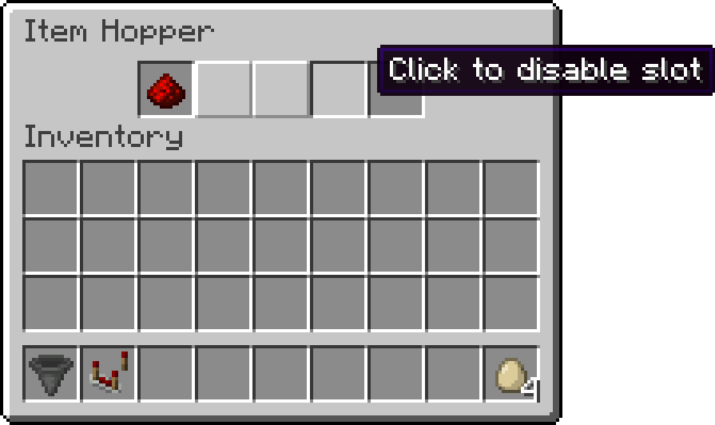

# Disableable Hopper Slots
Welcome to the *Disableable Hopper Slots* Minecraft mod.

Are you tired of filling your item filters with dummy items ? Do you like how the new crafter allows to enable and disable some of its slots. Well, this mod is for you !

Hopper slots can now be enabled or disabled, which can be toggled by clicking on them when empty. Disabled slots cannot have items put in them.

Only the enabled slots of the hopper count towards the _"total number of slots in container"_ when calculating the signal strength with a comparator. 

           
